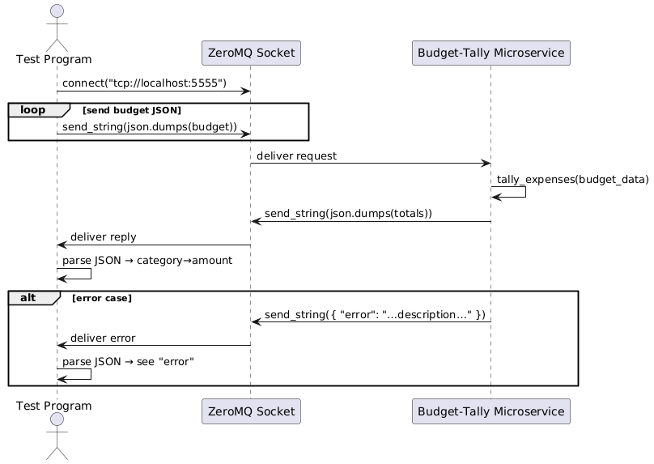

# MicroserviceA

This microservice accepts a JSON-encoded budget, tallies all non-zero expense categories, and returns a JSON map of category → total.

---

## 🔌 Endpoint & Protocol

- **Protocol:** ZeroMQ REQ/REP  
- **URL:** `tcp://<HOST>:5555`  
  (Use `localhost:5555` for local testing)

---

## 📤 Example Request (Python)

```python
import zmq, json

ctx = zmq.Context()
sock = ctx.socket(zmq.REQ)
sock.connect("tcp://<HOST>:5555")

payload = {
  "expenses": {
    "rent": {"Rent": 1400.0},
    "groceries": {"weekly": 150.0}
  }
}

sock.send_string(json.dumps(payload))

## 🖼 UML Sequence Diagram


